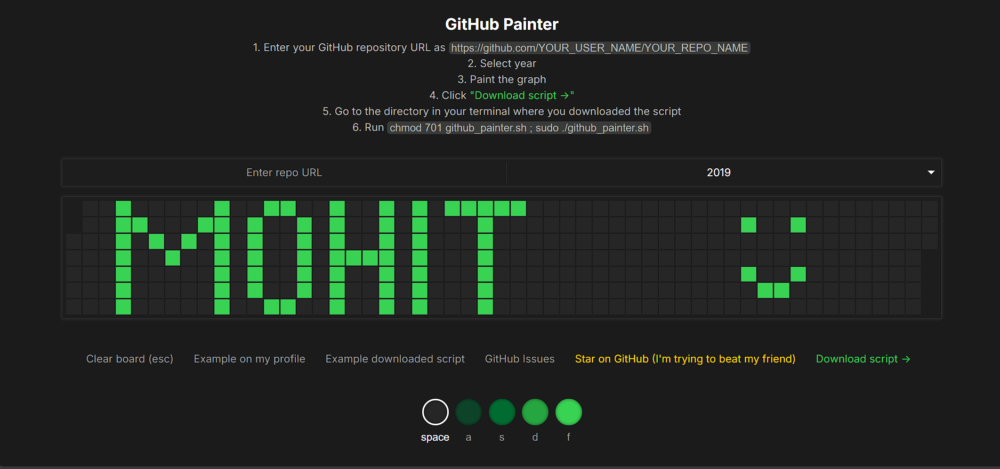

# GitHub-Graph-Painter
Create a custom design for your GitHub Commit Contribution Graph.

# GitHub Contribution Graph Painter

<h3 align="left"><a href="https://githubgraphpainter.vercel.app/">Try the editor</a></h3>

### Usage

1. Add your repo URL to the spot seen above. **I highly reccomend using a new empty private repo in case something goes wrong.**
2. Select the year you want to paint to, for the best results, ensure this year is *free from commits* on your GitHub profile. This tool assumes you have none.
3. Paint on the canvas using the different colors.
4. Download the script, as seen above. You may have to run the command `chmod 701 github_painter.sh` to give executable permission to the file. Then, run `sudo ./github_painter.sh` to run the script.

### Troubleshooting

- To delete the art, you can always delete the repository that the commits took place in. This is the easy way out. For more complex cases, refer to [this](https://stackoverflow.com/questions/448919/how-can-i-remove-a-commit-on-github) Stack Overflow question.
- If you're not seeing the art appear, please toggle the "Private Contributions" setting on your GitHub profile. It seems to help things sync up:

  

### Notes

- Use at your own risk, because I feel like committing a bunch of times could mess something up if used incorrectly. So, be careful, know what you're doing, and check the outputted `github_painter.sh` script before using it.

### Feel free to create Issues or PRs!

- Issues [here](https://github.com/Mohit-005/github_painter/issues).
- PRs [here](https://github.com/Mohit-005/github_painter/pulls).